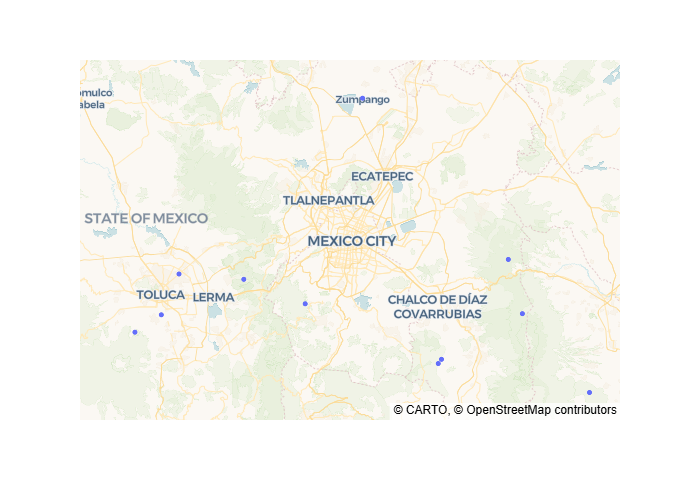
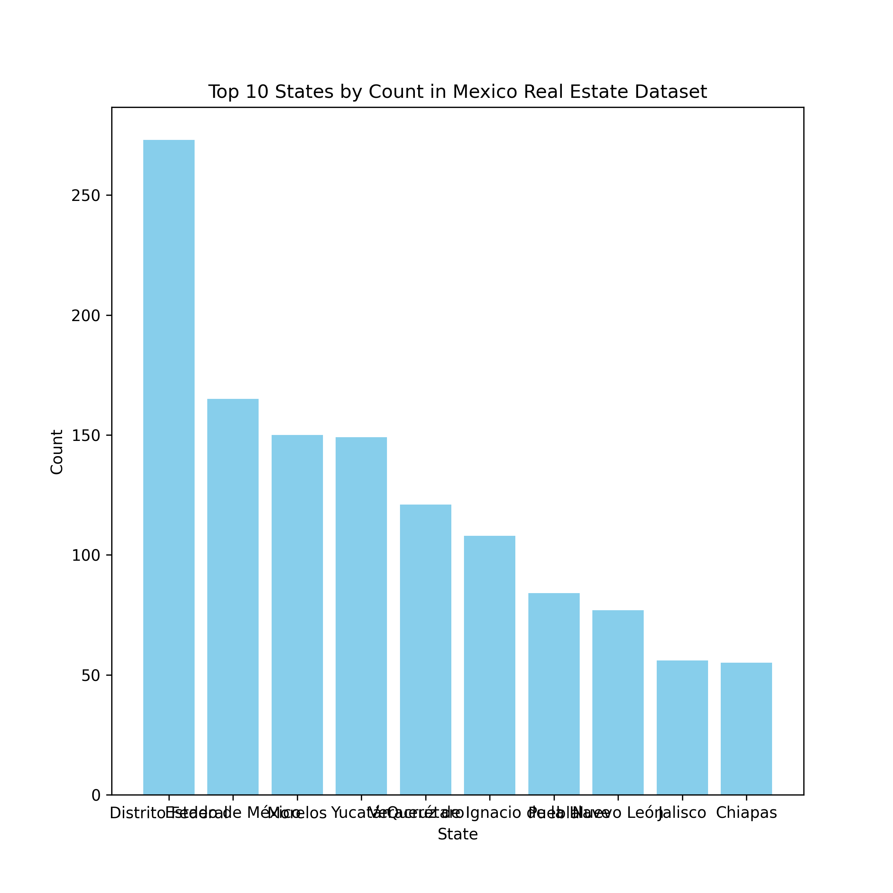
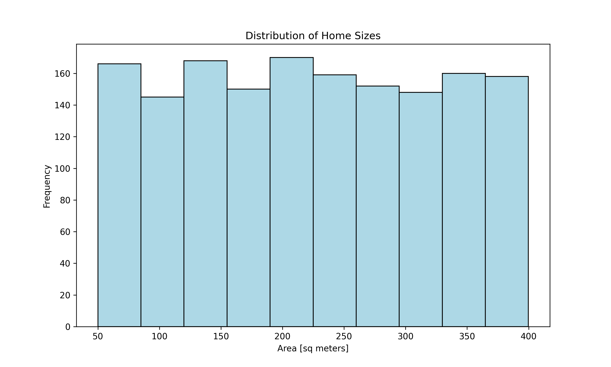
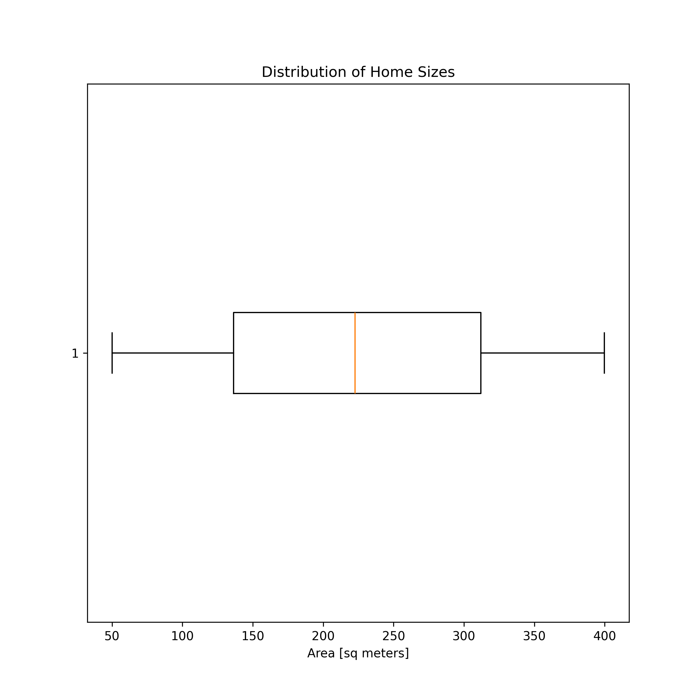

# wqa_project_1

PROJECT 1 - MEXICO HOUSING PROJECT

In this project, I'll work with a dataset with 21,000 properties for sale in Mexico through the real estate website Properati.com. My goal is to determine whether sale prices are influenced more by property size or location.

Some of the things I'll learn in this project are:

How to organize information using basic Python data structures.

How to import data from CSV files and clean it using the pandas library.

How to create data visualizations like scatter and box plots.

How to examine the relationship between two variables using correlation.

The project consists of four lessons and one assignment. I'll work through the lessons following WordQuant Instructor  code-along videos.

Each of the following tasks were carried out:

Task 1: Clean df1 by dropping rows with NaN values. Then remove the "$" and "," characters from "price_usd" and recast the values in the column as floats.

Task 2: First, drop rows with NaN values in df2. Next, use the "price_mxn" column to create a new column named "price_usd". (Keep in mind that, when this data was collected in 2014, a dollar cost 19 pesos.) Finally, drop the "price_mxn" from the DataFrame.

Task 3: Drop rows with NaN values in df3. Then use the split method to create two new columns from "lat-lon" named "lat" and "lon", respectively.

Task 4: Use the split method again, this time to extract the state for every house. (Note that the state name always appears after "México|" in each string.) Use this information to create a "state" column. Finally, drop the "place_with_parent_names" and "lat-lon" columns from the DataFrame.

Task 5: Concatenate df1, df2, df3 as new DataFrame named df and then save it as a CSV file

EXPLORATORY DATA ANALYSIS SECTION
This section is for exploratory data analysis (EDA) of the cleaned dataset.

Task 1: Visualize the locations usig lat and lon using a scatter plot on top of a map using the scatter_map from plotly library. 

Task 2: Determine the 10 most prevalent states in our dataset and visualize it

Task 3: Create a histogram of "area_m2". Make sure that the x-axis has the label "Area [sq meters]", the y-axis has the label "Frequency", and the plot has the title "Distribution of Home Sizes".

TASK 4: Create a horizontal boxplot of "area_m2". Make sure that the x-axis has the label "Area [sq meters]" and the plot has the title "Distribution of Home Sizes". How is the distribution and its left skew represented differently here than in your histogram?

TASK 5: Create a histogram of "price_usd" and a horizontal boxplot of "price_usd"

LOCATION OR SIZE: WHAT INFLUENCES HOUSE PRICES IN MEXICO?

Research Question 1
Which state has the most expensive real estate market?
        Do housing prices vary by state? If so, which are the most expensive states for purchasing a home? During our exploratory data analysis, we used descriptive statistics like mean and median to get an idea of the "typical" house price in Mexico. Now, we need to break that calculation down by state and visualize the results.
        We know in which state each house is located thanks to the "state" column. The next step is to divide our dataset into groups (one per state) and calculate the mean house price for each group.

Task 1: Use the groupby method to create a Series named mean_price_by_state, where the index contains each state in the dataset and the values correspond to the mean house price for that state. Make sure your Series is sorted from highest to lowest mean price, and then visualize

Task 2: A better metric to look at would be price per m2. Determine Price_per_m2 and visualize. 

